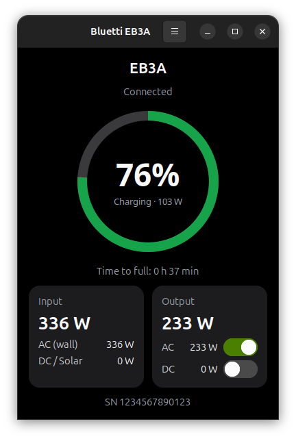
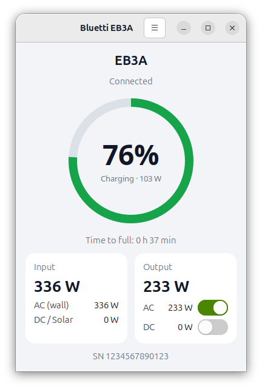

# bluetti-linux

Tray monitor for a Bluetti **EB3A** over Bluetooth LE. Shows a coloured battery icon (green,
red at 20% or below, bolt while charging) and battery % in the top bar, and a
dashboard window (battery ring, input/output cards, AC/DC on/off switches, runtime estimate)
similar to the Android app. The only thing it ever writes to the device is the AC/DC output
switches; turning AC off asks for confirmation first.

## Screenshots

Top bar (battery → ↓ input → ↑ output):


Dashboard, dark and light theme:

<p>
  
  
</p>

<sub>Rendered from the app's own widgets and icons with sample data.</sub>

## Install (Ubuntu)

```bash
sudo apt install python3-bleak
git clone https://github.com/fgtb599/bluetti-linux.git
cd bluetti-linux
```

The tray icons use the StatusNotifierItem D-Bus protocol directly, so no AppIndicator library is needed.
GNOME needs the AppIndicator extension (`ubuntu-appindicators@ubuntu.com`, enabled by default on Ubuntu);
if it is off, the app says so at startup.

## Run

```bash
python3 bluetti_tray.py              # active device from Devices…, else the first EB3A* found
python3 bluetti_tray.py --address XX:XX:XX:XX:XX:XX --interval 3   # one-off override
python3 bluetti_tray.py --hidden     # tray only
```

Only one copy runs at a time: starting it again (from the terminal, the app grid or the dock) just
opens the running one's dashboard.

Both the tray menu and the dashboard's ☰ menu have:

- **Theme**: System (follows GNOME light/dark), Light or Dark
- **Tray view**: *Battery* (coloured battery + `99%`) or *Battery + in/out*, which adds a green ↓ input
  and an orange ↑ output item with their watts (grey at 0 W)
- **Devices…**: saved units, which one is active, and a scan for nearby EB3As
- **About**: app version and license, plus the connected unit's model, serial, address and firmware

Settings live in `~/.config/bluetti-linux/config.json`.

The EB3A accepts **one BLE connection at a time** — close the phone app (or turn off phone
Bluetooth) or the PC will not find it.

## App launcher and autostart

```bash
./install.sh               # "Bluetti EB3A" in the app grid and search, ready to pin to the dock
./install.sh --autostart   # also start hidden in the tray at login
./install.sh --uninstall   # remove both
```

The entries point at this checkout, so re-run `./install.sh` after moving it. They live in
`~/.local/share/applications/` and `~/.config/autostart/`; to always use one unit, add
`--address XX:XX:XX:XX:XX:XX` to their `Exec=` line (or just pick it in Devices…).

## Tests

```bash
python3 -m unittest discover tests
```

Protocol and register map are based on the community
[bluetti_mqtt](https://github.com/warhammerkid/bluetti_mqtt) project.

## License

MIT — see [LICENSE](LICENSE).
